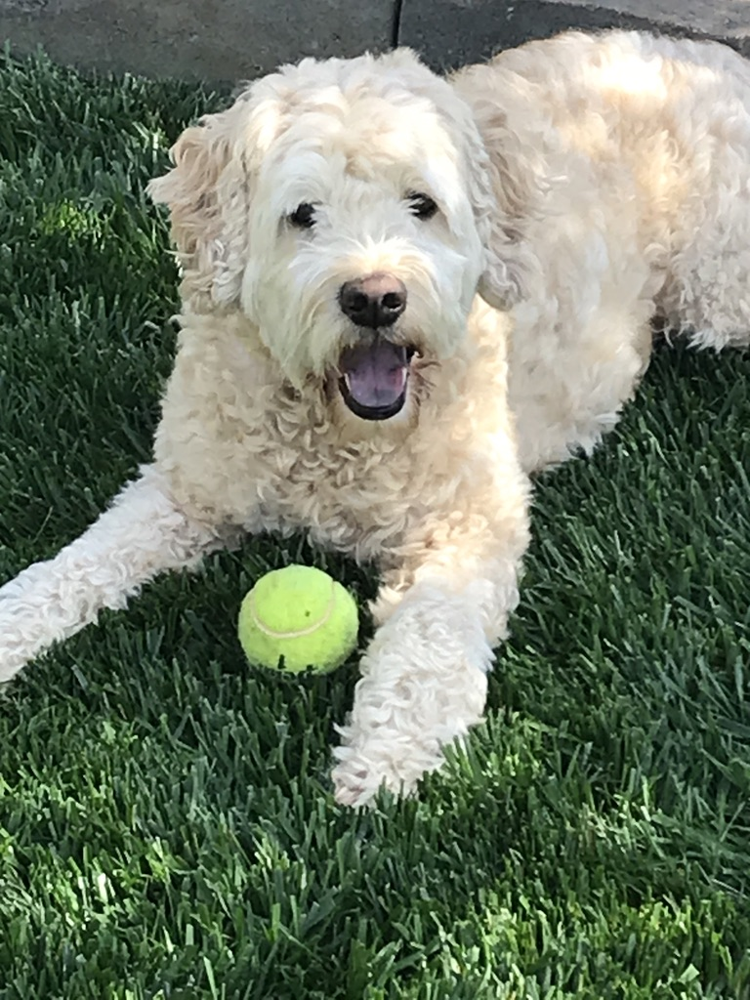
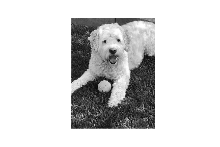
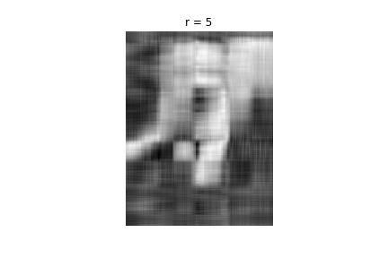
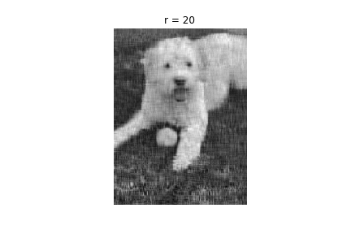
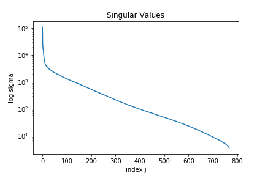
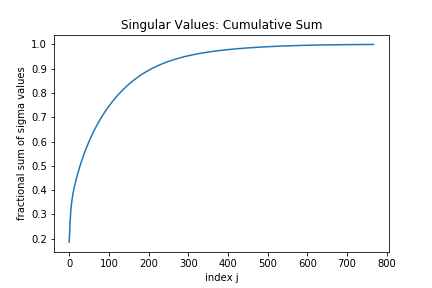

## Using Singular Value Decomposition (SVD) for image compression of my dog Sunny!

Meet **Sunny**, my goldendoodle!



Let's convert RGB image to grayscale.

```
A = imread('Sunny.jpeg')
X = np.mean(A, -1) # convert RGB to grayscale
```




Let's use singular value decomposition (SVD) to compress the image of Sunny.
First, we'll calculate the singular value decomposition using numpy.

```
U, S, VT = np.linalg.svd(X, full_matrices=False)
S = np.diag(S)
```


Next, we'll test various rank r values and look at the effect on image.

```
j=0
for r in (5, 20, 100):
    # construct approximate image
    # vary rank r
    Xapprox = U[:,:r] @ S[0:r,:r] @ VT[:r,:]
    plt.figure(j+1)
    j += 1
    img = plt.imshow(Xapprox)
    img.set_cmap('gray')
    plt.axis('off')
    plt.title('r = ' + str(r))
    plt.savefig(f'pics/sunny_grayscale{str(r)}.png');
```

Let's see how Sunny look at various rank r values -





Let's plot the singular values and the cumulative sum.





We can see that the majority of the information can be retrieved after truncating beyond the 100th singular value.